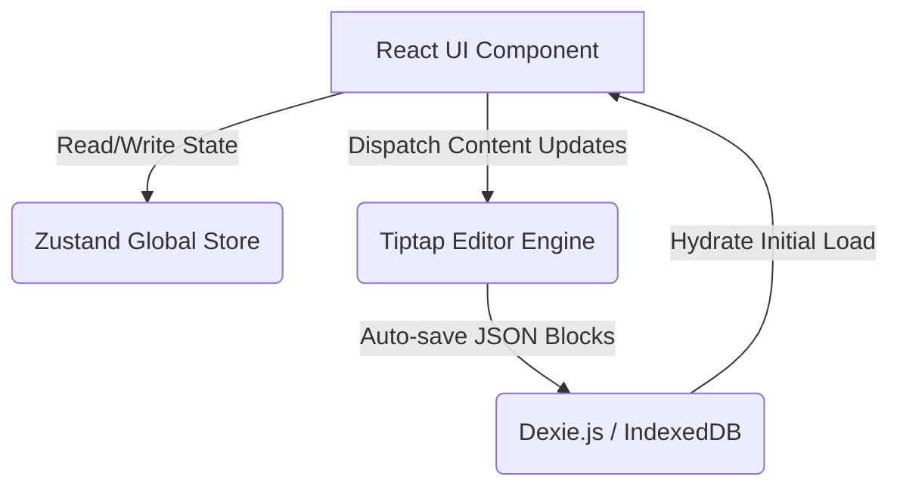

# 🌌 Ephemeris
> A local-first workspace for charting your thoughts. Zero latency, absolute privacy.

[](https://opensource.org/licenses/MIT)

## 💡 Motivation (The Problem)
- **SaaS Fatigue & Privacy**: Modern note-taking apps force users into subscription-based cloud ecosystems, raising concerns over data privacy and the fear of losing access to personal thoughts if a service shuts down.
- **Latency & Bloat**: Heavy cloud synchronization often leads to clunky interfaces and slow load times that distract from the pure act of writing.

## 🎯 Solution (What it does)
- **True Local-First Architecture**: Ephemeris stores all of your notes, emojis, and cover images entirely in your browser using IndexedDB. No cloud sync means absolute privacy and instantaneous performance.
- **Rich Block Editing**: Not just a markdown parser—Ephemeris uses Tiptap to provide a robust, Notion-like block-based writing experience.
- **Premium Aesthetic**: Designed as a clean, distraction-free environment with crisp typography and smooth micro-animations that feel like a native app.

### 📩 Example Output
*(Add screenshot of the Ephemeris Workspace here)*

## 🏗️ Architecture & Data Flow



## 🛠️ Tech Stack & Decisions

| Component | Choice | Why this over alternatives? |
| --------- | ------ | --------------------------- |
| **Framework** | React + Vite | Provides a blazing fast local development server and optimized, lightweight production builds. |
| **Database** | Dexie.js | A powerful wrapper around IndexedDB. Makes working with asynchronous, local-first browser data as simple as querying a NoSQL DB. |
| **State Management**| Zustand | Extremely lightweight and simple compared to Redux; perfect for managing UI state (like the active page) without boilerplate. |
| **Rich Text** | Tiptap | A headless editor framework that allows pixel-perfect replication of complex, block-based typing experiences, unlike standard textareas. |
| **Styling** | Vanilla CSS | Provides maximum flexibility for precise micro-animations and aesthetic tweaks without relying on heavy or opinionated UI libraries. |

## 🚀 Quick Start (Setup)

1. Prerequisites: Node.js (>= 20).
2. Clone the repository and install dependencies:
   ```bash
   git clone https://github.com/yourusername/ephemeris.git
   cd ephemeris
   npm install
   ```
3. Run the development server:
   ```bash
   npm run dev
   ```

## 📈 Roadmap & Maintenance
- **Graph View (The Constellation)**: A visual representation linking related notes together like stars, allowing users to see the connections between their thoughts.
- **Peer-to-Peer Syncing**: Explore WebRTC and CRDTs for true peer-to-peer syncing across devices without relying on a central database.
- **Nested Pages**: Implement document trees to allow pages to have infinite child pages in the sidebar.

## 📄 License
This project is licensed under the MIT License - see the [LICENSE](LICENSE) file for details.
