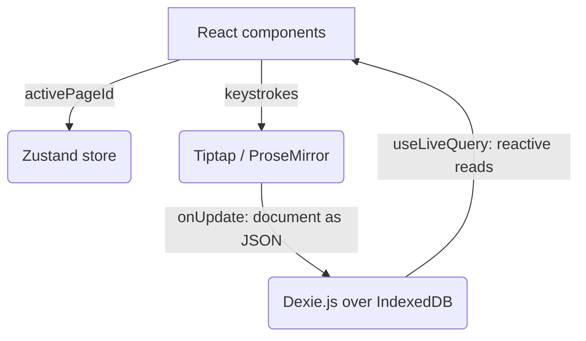

# Ephemeris

A local-first note workspace that keeps every page in the browser and never talks to a server.

[](https://opensource.org/licenses/MIT)


## Motivation

I wanted a Notion I owned. Not a cheaper Notion or a faster one, but one where the notes sit on my machine and keep working when a company changes its pricing, its terms, or its mind about staying in business. The long-term idea was to put a model on top of my own notes rather than hand them to someone else's.

Ephemeris is the first cut at the substrate that would need: a workspace where pages, covers, and icons live in the browser's own database, with no account and no network call anywhere in the write path.

## What it does

- Create pages from a sidebar and switch between them
- Write rich text through Tiptap's StarterKit: headings, lists, bold and italic, code blocks, blockquotes, driven by markdown-style input rules and keyboard shortcuts rather than a toolbar
- Give a page an icon and a cover image, uploaded from disk and stored inline
- Persist every change to IndexedDB as it is typed, so there is no save button and no loading state
- Press Enter in the title to drop focus into the body

There is no sign-up, no server, and no network request. Opening the app offline behaves exactly the same as opening it online.

## Architecture



Reads go through `dexie-react-hooks`, so a write to the database re-renders whatever is showing it without any manual refresh. Writes are unbuffered: each editor update is one IndexedDB write.

```text
ephemeris/
├── src/
│   ├── db/db.js                  # Dexie schema, seeds a welcome page on first run
│   ├── store/useStore.js         # Zustand store, holds the active page id
│   └── components/
│       ├── Sidebar.jsx           # Page list and creation
│       └── PageEditor.jsx        # Title, icon, cover, and the Tiptap surface
└── vite.config.js
```

## Tech Decisions

| Component | Choice | Why this over alternatives |
| --- | --- | --- |
| Storage | Dexie.js over raw IndexedDB | The native IndexedDB API is event-based and verbose for even simple queries. Dexie gives promises, and `useLiveQuery` turns a table into a reactive source, which removes the need for a data-fetching layer |
| Editor | Tiptap over a textarea or a markdown parser | ProseMirror stores the document as structured JSON, not a string. Block-level features later depend on the content already being a tree |
| State | Zustand over Context or Redux | Exactly one value is global, the active page id. That is six lines in Zustand and a provider tree in the alternatives |
| Build | React + Vite | Fast dev server, and a static bundle is the entire deployment story for an app with no backend |
| Styling | Vanilla CSS | No component library to fight for control of spacing and animation at this size |
| Cover images | Base64 inside the page record | Keeps everything in one store, so a page is self-contained and there are no file handles to re-request permission for. The cost is database size, which is unmeasured |

## Results & Limitations

Nothing here has been measured. There are no tests, no benchmarks, and the app has never been deployed or used beyond local development.

- **There is no export or import.** This is the serious one. The whole motivation was not losing notes to somebody else's decision, and right now clearing site data in the browser destroys everything with no recovery path. The prototype moved the risk rather than removing it.
- **Pages cannot be deleted.** The sidebar creates and selects; nothing removes. Renaming works only by editing the title in the editor.
- **There is no search.** Once the page count passes what fits in the sidebar, there is no way to find anything.
- **Nested pages do not exist.** The schema carries a `parentId` column and it is never set to anything but `null`.
- Every keystroke is an IndexedDB write, with no debounce. It has not caused a visible problem at this size, but it has not been profiled either.
- The icon picker is a browser `prompt()` asking the user to type an emoji.
- The IndexedDB database is still named `NotionCloneDB` from the scaffold. Renaming it needs a migration, since existing local data is keyed to the old name.

## Getting Started

Requires Node.js 20 or later.

```bash
git clone https://github.com/liminal-cipher/ephemeris.git
cd ephemeris
npm install
npm run dev
```

There is nothing to configure. No environment variables, no API keys, no database to provision, because there is no backend. `npm run lint` runs oxlint, and `npm run build` produces a static bundle.

## Retrospective

**Building the shell before the thing that made it worth having was the wrong order.** The editor, the sidebar, the covers, and the icons are the parts every note app already has, and they are the parts a user would abandon this one over anyway. The reason to write my own was owning the data and eventually running a model against it, and neither of those got started. If I picked this up again I would begin with export and import, because a local-first app without them is a worse guarantee than the cloud service it was meant to replace, and then with retrieval over my own notes.

The technical choices held up. Structuring content as ProseMirror JSON rather than markdown text, and putting `parentId` in the schema from the start, both leave room for the block-level and nested-page work without a migration. The ideas that stayed unbuilt, a graph view over linked notes and peer-to-peer sync through CRDTs, are still the right ones. They are just further away than a three-day prototype suggests.

## Status

Paused. No work since 2026-07-23, and no active plan to resume.

## License

MIT. See [LICENSE](LICENSE).
