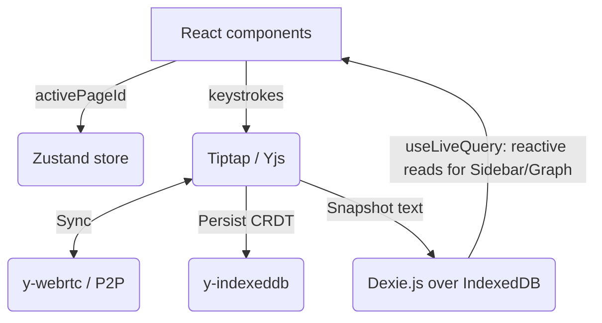

# Ephemeris

> A local-first note workspace that keeps every page in the browser and does not depend on a centralized application backend.

[](https://opensource.org/licenses/MIT)


## Motivation

I wanted a Notion I owned. Not a cheaper Notion or a faster one, but one where the notes sit on my machine and keep working when a company changes its pricing, its terms, or its mind about staying in business. The long-term idea was to put a model on top of my own notes rather than hand them to someone else's.

Ephemeris is the first cut at the substrate that would need: a workspace where pages, covers, and icons live in the browser's own database, with no account and no centralized application database in the write path.

## What It Does

- **Hierarchical Document Model:** Organize notes with infinitely nested sub-pages, drag-and-drop re-parenting, collapsible tree toggles, and interactive breadcrumbs.
- **Collaborative Editing:** Edit notes with peers in real time over WebRTC without sending document contents through an application backend. WebRTC still uses signaling servers to establish peer connections.
- **Unified Details Panel:** Access sub-pages and backlinks via a dockable panel (bottom or right sidebar) to maintain context without cluttering the editor.
- **Graph View:** Visualize connections between pages linked via `[[wiki-link]]` syntax on an interactive 2D physics graph.
- **Rich Text Editing:** Write using Tiptap's markdown-style input rules and keyboard shortcuts, complete with mathematical formulas (KaTeX), code blocks, and double-click whitespace trimming.
- **Customization:** Assign pages an icon (from a full 1,484 Unicode catalog, uploaded images, or remote URLs) and a cover image, stored inline.
- **Offline & Portable:** Persist every change automatically using CRDTs (`y-indexeddb`) and Dexie fallback snapshots. Export the entire workspace to JSON for true data portability.

There is no sign-up or application backend, and no network request is required to write. Opening the app offline behaves exactly the same as opening it online for local editing.

## Architecture



We use a hybrid architecture: `Dexie.js` powers the reactive sidebar metadata and graph view indexing, while `Yjs` handles rich text conflict resolution and peer-to-peer sync for the active page editor.

## Tech Decisions

| Component | Choice | Why this over alternatives |
| --- | --- | --- |
| Storage | Dexie.js over raw IndexedDB | The native IndexedDB API is event-based and verbose for even simple queries. Dexie gives promises, and `useLiveQuery` turns a table into a reactive source, which removes the need for a data-fetching layer |
| CRDT | Yjs over Automerge | Yjs has mature ProseMirror/Tiptap integration and modular persistence and sync providers such as `y-webrtc` and `y-indexeddb` |
| Sync | y-webrtc over WebSocket server | WebRTC lets peers exchange CRDT updates directly without running an application backend. Signaling is still required to establish connections, so the current setup relies on public signaling servers |
| Graph View | react-force-graph-2d over raw D3 | Provides a canvas-based physics simulation for note connections without manually managing D3 DOM updates inside React |
| Editor | Tiptap over a textarea or a markdown parser | ProseMirror stores the document as structured JSON, not a string. Block-level features later depend on the content already being a tree |
| State | Zustand over Context or Redux | Exactly one value is global, the active page id. That is six lines in Zustand and a provider tree in the alternatives |
| Testing | Vitest + RTL over Jest | Native ESM and Vite integration keep configuration small and support fast local feedback |

## Results & Limitations

- **Signaling Server Dependency.** While document data sync is P2P, WebRTC requires signaling servers to establish the initial connection. We currently rely on public signaling servers which are not guaranteed for production uptime.
- **Database size constraints.** Storing base64 cover images inline keeps pages self-contained, but the performance impact on Dexie.js and Yjs at scale remains unmeasured.

## Getting Started

Requires Node.js 20 or later.

```bash
git clone https://github.com/liminal-cipher/ephemeris.git
cd ephemeris
npm install
npm run dev
```

There is nothing to configure. No environment variables, no API keys, and no application backend to provision.
Tests can be run with `npm run test`.

## Roadmap

- [x] **Local-first core & CRDTs**: Offline workspace management with Yjs CRDTs, unified panels, and Graph View.
- [ ] **Performance optimization**: Virtualized rendering for the sidebar tree to support workspaces scaling past thousands of notes smoothly.
- [ ] **Enhanced media integration**: Custom image URLs and Unsplash integrations for page covers alongside local file uploads.
- [ ] **Multi-page bulk operations**: Dragging and re-parenting multi-selected notes simultaneously in the sidebar tree.
- [ ] **Tiptap v3 upgrade**: Transition to Tiptap 3.x ecosystem once dependencies and collaboration APIs stabilize.
- [ ] **Asynchronous sync (Relay Server)**: Lightweight encrypted relay (e.g. `y-websocket`) for asynchronous peer synchronization.

## Status

In progress. Local development resumed. Last updated 2026-09-13.

## License

MIT. See [LICENSE](LICENSE).
